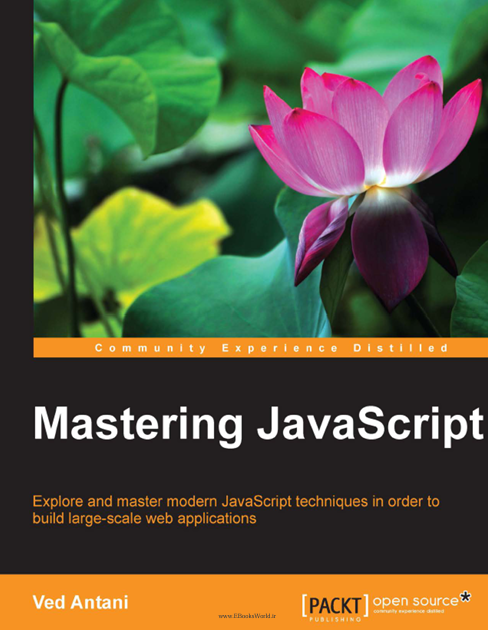
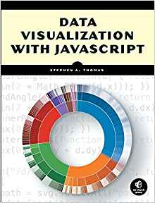

# Learn JavaScript

- [Learn JavaScript](#learn-javascript)
  - [Featured Contents](#featured-contents)
    - [Learn Next.js - (1) React Foundations](#learn-nextjs---1-react-foundations)
    - ["Mastering Javascript"](#mastering-javascript)
  - [Resources on JavaScript](#resources-on-javascript)
  - [Learning Resources for HTML / CSS / Javascript](#learning-resources-for-html--css--javascript)
    - [General](#general)
    - [HTML](#html)
    - [CSS](#css)
    - [Javascript](#javascript)
  - [Other learning](#other-learning)

## Featured Contents

### Learn Next.js - (1) React Foundations

| Cover | Learning Notes | Packaged Course |
| --- | --- | --- |
|  | [Notes Readme](./learn_nextjs/1_React-Foundation/README.md) | Udemy course:  |

### "Mastering Javascript"

| Cover | Learning Notes | Packaged Course |
| --- | --- | --- |
|  | [Notes Readme](mastering_js/README.md) | Udemy online course will be available soon... |

<!--  -->

## Resources on JavaScript

Here is a list of resources that may be helpful as you continue your learning journey.

T​hese resources provide some more in-depth information on the topics covered in this module.

[Mozilla Developer Network Expressions and Operators ](https://developer.mozilla.org/en-US/docs/Web/JavaScript/Reference/Operators)

[Mozilla Developer Network Operator Precedence and Associativity ](https://developer.mozilla.org/en-US/docs/Web/JavaScript/Reference/Operators/Operator_Precedence)

[JavaScript Primitive Values ](https://developer.mozilla.org/en-US/docs/Glossary/Primitive)

[ECMA262 Specification ](https://tc39.es/ecma262/)

[jQuery Official Website ](https://jquery.com/)

[React Official Website ](https://reactjs.org/)

[StackOverflow Developer Survey 2021 Most Popular Technologies](https://insights.stackoverflow.com/survey/2021#technology-most-popular-technologies)

[Emojis](http://unicode.org/emoji/charts/full-emoji-list.html#1f600)

## Learning Resources for HTML / CSS / Javascript

### General

- https://www.w3schools.com/ - Free HTML, CSS, Javascript (and more) tutorials
- https://caniuse.com/ - Find out which browsers support which features

### HTML

- https://app.pluralsight.com/path/skills/html5 HTML skill path

### CSS

- https://app.pluralsight.com/path/skills/css CSS skill path

### Javascript

- https://app.pluralsight.com/path/skill/javascript Javascript skill path

[Things to learn on Javascript before React](Things%20to%20learn%20on%20Javascript%20before%20React.md):

1. map() & filter()
2. slice() & splice()
3. concat()
4. find() & findIndex()
5. destructuring
6. rest & speed operator
7. promises

## Other learning

starting from 2017/11/28:
reading the book: 《JavaScript数据可视化编程》(Data Visualization with JavaScript)

- 数据可视化是解决数据被浪费的重要工具。
- 好的可视化追求的目标是让数据自身一目了然，让关注数据的人可以因此快速抓住数据的核心。
- 如果把大数据处理技术比做加法，那么数据可视化就像是教你如何优雅地做减法。

---

Last updated at 1/24/2026, 6:13:31 PM 