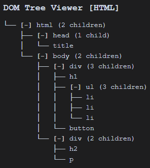
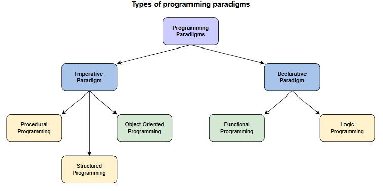

# React Foundations

URL at Next.js Learn: https://nextjs.org/learn/react-foundations

- [React Foundations](#react-foundations)
  - [Packaged Demo Videos in Udemy](#packaged-demo-videos-in-udemy)
  - [00. Introduction](#00-introduction)
  - [01. About React and Next.js](#01-about-react-and-nextjs)
  - [02. Rendering User Interfaces (UI)](#02-rendering-user-interfaces-ui)
  - [03. Updating UI with Javascript](#03-updating-ui-with-javascript)
  - [04. Getting Started with React](#04-getting-started-with-react)
    - [The rules of JSX](#the-rules-of-jsx)
    - [Handle JSX](#handle-jsx)
  - [05. Building UI with Components](#05-building-ui-with-components)
    - [5.1 Build Single Component](#51-build-single-component)
    - [5.2 Nesting Components](#52-nesting-components)
  - [06. Displaying Data with Props](#06-displaying-data-with-props)
  - [07. Adding Interactivity with State](#07-adding-interactivity-with-state)
  - [08. From React to Next.js](#08-from-react-to-nextjs)
  - [09. Installing Next.js](#09-installing-nextjs)
  - [10. Server and Client Components](#10-server-and-client-components)

## Packaged Demo Videos in Udemy

Click image for getting promotion code to enroll today:

[](https://www.udemy.com/course/mastering-nextjs-1-react-foundations/?referralCode=271291A46585F5827557)

## 00. Introduction

## 01. About React and Next.js

## 02. Rendering User Interfaces (UI)

View HTML page's DOM Structure, use `DOM Tree Viewer` VS Code extension.

DOM - Document Object Model ([Introduction of DOM](https://developer.mozilla.org/en-US/docs/Web/API/Document_Object_Model))

The DOM is an object representation of the HTML elements. It acts as a bridge between your code and the user interface, and has a tree-like structure with parent and child relationships.

Sample HTML file:

```html
<html>
    <head>
        <title>My Testing</title>
    </head>
    <body>
        <div>
            <h1>Team</h1>
            <ul>
                <li>A. Lovelace</li>
                <li>G. Hopper</li>
                <li>M. Hamilton</li>
            </ul>
            <button>Like (0)</button>
        </div>
        <div>
            <h2></h2>
            <p></p>
        </div>
    </body>
</html>
```

The DOM tree structure is as:



## 03. Updating UI with Javascript

Imperative vs. declarative programming (命令式编程与声明式编程)



| | Imperative Programming | Declarative Programming |
| --- | --- | --- |
| 1. Computation | You describe the **step-by-step instructions for how** an executed program achieves the desired results. | You set the **conditions** that trigger the program execution to produce the desired results. |
| 2. Readability and Complexity | With the emphasis on the control flow, you can often follow the step-by-step process fairly easily.<br/>However, as you add more features and code to your program, it can become **longer and more complex**, making it increasingly confusing and time-consuming to read. | Step-by-step processes are eschewed (回避). You'll discover that this paradigm (范例) is **less complex and requires less code**, making it easier to read. |
| 3. Customization | A straightforward way to customize and edit code and structure is offered. You have **complete control** and easily adapt the structure of your program to your needs.<br/>However, because you might have to deal with more code, you're more likely to run into editing errors than with declarative programming. | **Customizing the source code is more difficult** because of complicated syntax and paradigm's dependence on impelmentating a pre-configured algorithm.<br/>Some declarative programming programs may require more specificity to execute complex algorithms and functions. |
| 4. Optimization | Adding extensions and making upgrades are supported, but doing so is **significantly more challenging** than with declarative programming, making it harder to optimize. This owes to the step-by-step structure of the paradigm and the fact that simple tasks require more code to process. The longer the code, the more likely you will run into errors. | You can **easily optimize code** because an algorithm controls the implementation. Furthermore, you can add extensions and make upgrades. |
| 5. Structure | The code structure can be **long and complex**. The code itself specifies how it should run and in what order. Due to the increased complexity, the code can sometimes be confusing because it may perform more than one task.<br/>代码结构可能很长也很复杂。代码本身规定了它的运行方式和运行顺序。由于复杂性的增加，代码有时会让人感到困惑，因为它可能执行多个任务。 | The code structure is **concise and precise**, and it lacks detail. Not only does this paradigm vastly limit the complexity of your code, but the code is more efficient.<br/>代码结构简洁明了，但缺乏细节。这种模式不仅大大降低了代码的复杂性，而且提高了代码效率。 |

*Source: [educative.io/blog/](https://www.educative.io/blog/declarative-vs-imperative-programming)*

Using Python to show these two paradigms:

Imperative Programming --

```python
# Calculate total in the list
total = 0
mylist = [1,2,3,4,5]

# Create a for loop to add numbers in the list to the total
for x in mylist:
  total += x
print(total)
```

Declarative Programming --

```python
mylist = [1,2,3,4,5]

# Set total to the sum of numbers in mylist
total = sum(mylist)
print(total)
```

Reference resources:

- [HTML vs. the DOM](https://developer.chrome.com/docs/devtools/dom/#appendix)
- [UI: declarative vs. imperative](https://react.dev/learn/reacting-to-input-with-state#how-declarative-ui-compares-to-imperative)

## 04. Getting Started with React

React CDN Links: https://legacy.reactjs.org/docs/cdn-links.html

Add following two libraries for React:

```javascript
<script src="https://unpkg.com/react@18/umd/react.development.js"></script>
<script src="https://unpkg.com/react-dom@18/umd/react-dom.development.js"></script>
```

### The rules of JSX

1. Return a single root element
2. Close all the tags
3. camelCase ~~all~~ most of the thing!

### Handle JSX

Need a JavaScript compiler, e.g. [Bable](https://babeljs.io/), to transform JSX code into regula JavaScript.

Add below library for Bable JS compiler:

```javascript
<script src="https://unpkg.com/@babel/standalone/babel.min.js"></script>
```

## 05. Building UI with Components

`Components` is the smaller building blocks that user interfaces are broken down into.

### 5.1 Build Single Component

In React, components are `functions`. Inside `script` tag, create a new function called `header`:

```javascript
function header() {}
```

A `component` is a function that **returns UI elements**. Inside the `return` statement of the function, the JSX syntax is supported:

```javascript
function header() {
    return <h1>Develop. Preview. Ship.</h1>
}
```

To render this components to the DOM, pass it as the first argument in the `root.render()` method:

```javascript
<script type="text/jsx">
  const app = document.getElementById('app');
 
  function header() {
    return <h1>Develop. Preview. Ship.</h1>;
  }
 
  const root = ReactDOM.createRoot(app);
  root.render(header);
</script>
```

Some adjustments:

1. React components should be capitalized to distinguish them from plain HTML and JavaScript: `function Header() {}` instead of `function header() {}`
2. Need to use React components the same way as regular HTML tags, with angle brackets `<>`: so the three rules covering React are still applied.

### 5.2 Nesting Components

## 06. Displaying Data with Props

## 07. Adding Interactivity with State

## 08. From React to Next.js

## 09. Installing Next.js

Reference:
- [Next.js Routing Fundamentals](https://nextjs.org/docs/app/building-your-application/routing)
- [Defining Routes](https://nextjs.org/docs/app/building-your-application/routing/defining-routes)
- [Pages and Layouts](https://nextjs.org/docs/app/building-your-application/routing/pages-and-layouts)

Add Node related `.gitignore` content from https://gitignore.org/Node

## 10. Server and Client Components

---

Last updated at: 1/21/2026, 10:28:08 AM 